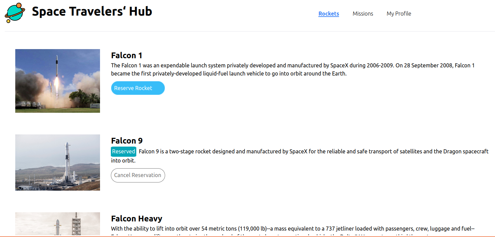
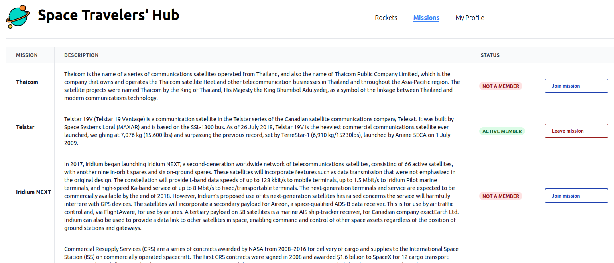
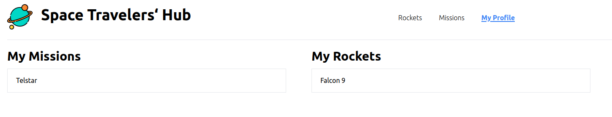

# Space Travelers‘ Hub

Fly to the moon. See what spring is like on A-Jupiter and Mars. Reserve a rocket or join a Mission on Space Travelers‘ Hub! 

Space Travelers‘ Hub makes [API requests to SpaceX data](https://api.spacexdata.com/) and allows you to reserve a rocket or join a mission, using React & Redux to achieve a unique user experience.

## Screenshot

### Rockets

### Missions

### My Profile

## Built With

- Tailwind CSS 
- React-Redux
- Jest

## Live Demo

[Live Demo Link](https://danalvrz.github.io/space-travelers-group-project/index)

## Getting Started

To get a local copy up and running follow the instructions.

### Setup

1. Open the terminal and clone the project using `git clone REPOURL` 

### Install

1. `cd` into the project folder and run `npm install`
2. Run the command `npm start`

## Tests

The test environment is set up with jest and jest-watcher run `npm test` to run tests.

## Authors

👤 **J.P**

- GitHub: [@Maclenn77](https://github.com/Maclenn77)
- Twitter: [@SrJuanPapas](https://twitter.com/SrJuanPapas)
- LinkedIn: [LinkedIn](https://www.linkedin.com/in/juanpaulopereztejada/)

👤 **Dante Alvarez**

- GitHub: [@danalvrz](https://github.com/danalvrz)
- Twitter: [@danalvrz](https://twitter.com/danalvrz)
- LinkedIn: [LinkedIn](https://www.linkedin.com/in/dante-álvarez-p)

## 🤝 Contributing

Contributions, issues, and feature requests are welcome!

Feel free to check the [issues page](https://github.com/danalvrz/space-travelers-group-project/issues).

## Show your support

Give a ⭐️ if you like this project!

## 📝 License

This project is [MIT](./MIT.md) licensed.